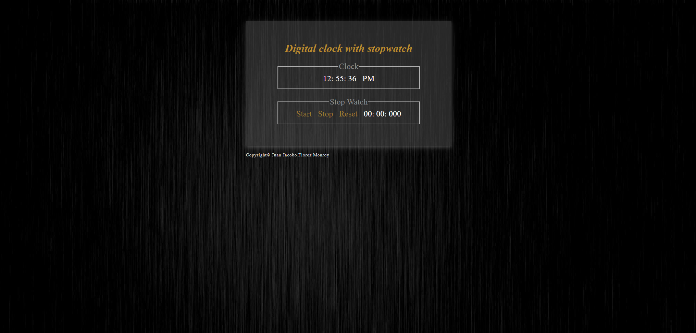

### ⏰ Clock & Stopwatch

## 📌 Project Overview  
This project is a **digital clock and stopwatch application** that displays the current time in a **12-hour format with AM/PM** while also providing a stopwatch feature. Users can **start, stop, and reset** the stopwatch using interactive buttons.  

It was developed as part of a **college assignment** to enhance JavaScript skills in **time-based functions** and DOM manipulation.

---

## 🌍 Live Demo

⏰ **Try it out here**: [Clock & Stopwatch Live Demo](https://clock-stopwatch-black.vercel.app)

---

## 🚀 Features  
💲 **Live Digital Clock**: Displays hours, minutes, and seconds in real time.  
🔄 **Auto Update**: The clock updates every second.  
🌙 **12-Hour Format with AM/PM**: Adjusts based on the time of day.  
🗓 **Stopwatch Functionality**: Users can **start, stop, and reset** a stopwatch.  
🎨 **Styled UI**: Includes a clean and modern design with CSS.  
📲 **Responsive Layout**: Works on different screen sizes.  

---

## 📌 Project Purpose  

This project demonstrates:

- **JavaScript Time Functions**: Utilizing setInterval for real-time updates and time-based logic.  
- **DOM Manipulation**: Managing real-time UI updates for the clock and stopwatch.  
- **User Interaction & Event Handling**: Implementing button controls for stopwatch functionality.  
- **CSS Styling & Responsive Design**: Ensuring visual appeal and accessibility across devices.  
- **Practical Implementation of ES6+ Concepts**: Using modern JavaScript features like template literals and event listeners.

---

## 👤 Project Structure  

📚 clock_stopwatch
 ├── 📚 imgs/               # Image assets
 ├── 📄 clock.css          # Styling for the clock and stopwatch
 ├── 📄 clock.js           # JavaScript logic for the clock and stopwatch
 ├── 📄 library_event.js   # JavaScript event management library
 ├── 📄 index.html         # Main HTML file for the application

---

## 🛠 Technologies Used  

- **🌐 HTML5**: Structure of the application.  
- **🎨 CSS3**: Styling and layout.  
- **📚 JavaScript (ES6+)**: Handles real-time clock updates and stopwatch functionality.  

---

## 📌 Prerequisites  

To run the project, ensure you have:  
- A modern web browser (**Chrome, Firefox, Edge, etc.**).  

---

## 🏃‍♂️ How to Use  

1️⃣ Open index.html in a web browser.  
2️⃣ The clock will start displaying and updating the current time automatically.  
3️⃣ To use the **stopwatch**:  
   - Click **Start** to begin the timer.  
   - Click **Stop** to pause it.  
   - Click **Reset** to clear the timer.  

---

## 🎭 Screenshots  

| Clock Stopwatch |  
|--------------|  
|  |  

---

## 📝 License  

This project was developed for **educational purposes** as part of a college assignment.

---

## 💼 Author

👤 **Juan Jacobo Florez Monroy**  
🌐 **Portfolio**: [jjacobo95.com](https://jjacobo95.com)  
🐙 **GitHub**: [github.com/jjacoboflorez95](https://github.com/jjacoboflorez95)